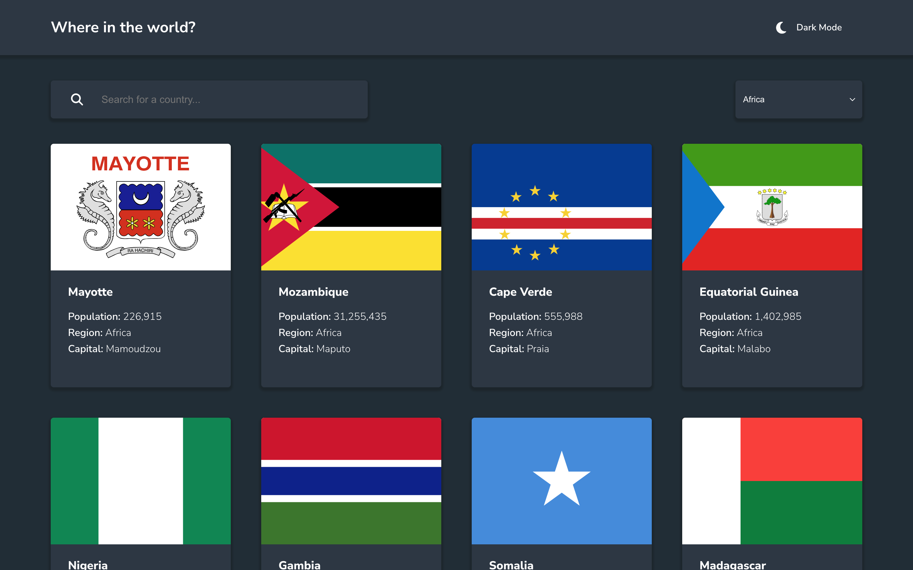

# React Countries Info Finder with Color theme switcher

This is a React solution to the [REST Countries API with color theme switcher challenge on Frontend Mentor](https://www.frontendmentor.io/challenges/rest-countries-api-with-color-theme-switcher-5cacc469fec04111f7b848ca). Frontend Mentor challenges help you improve your coding skills by building realistic projects. 
## Table of contents

- [Overview](#overview)
  - [The challenge](#the-challenge)
  - [Screenshot](#screenshot)
  - [Links](#links)
- [My process](#my-process)
  - [Built with](#built-with)
  - [What I learned](#what-i-learned)
  - [Continued development](#continued-development)
  - [Useful resources](#useful-resources)
- [Author](#author)
- [Acknowledgments](#acknowledgments)

## Overview

### The challenge

Users should be able to:

- See all countries from the API on the homepage
- Search for a country using an `input` field
- Filter countries by region
- Click on a country to see more detailed information on a separate page
- Click through to the border countries on the detail page
- Toggle the color scheme between light and dark mode *(optional)*

### Screenshot

### Links

- Solution URL: [https://github.com/techemmy/React-Countries-Finder](https://github.com/techemmy/React-Countries-Finder)
- Live Site URL: [https://countries-finder-tau.vercel.app/](https://countries-finder-tau.vercel.app/)

## My process

### Built with

- Semantic HTML5 markup
- CSS custom properties
- Flexbox
- CSS Grid
- Mobile-first workflow
- [React](https://react.dev/) - JS library

### What I learned
- React Router
- CSS color-scheme and prefers-color-scheme attributes

### Useful resources

- [React Router Official Documentation](https://reactrouter.com/en/main/start/tutorial) - This helped me with understanding how to route multiple pages to create an SPA (Single Page Application)
- [MDN Documentation](https://developer.mozilla.org/en-US/docs/Web/CSS/color-scheme) - This helped me with understanding how to use the css color-scheme and prefers-color-scheme attributes
- [Smashing Magazine](https://www.smashingmagazine.com/2024/03/setting-persisting-color-scheme-preferences-css-javascript/) - This assisted me with implementing the dark model toggler without javascript

## Author

- Frontend Mentor - [@techemmy](https://www.frontendmentor.io/profile/techemmy)
- Twitter - [@itechemmy](https://www.twitter.com/itechemmy)

## Acknowledgments
- Frontend Mentor - For UI and Project Inspiration
